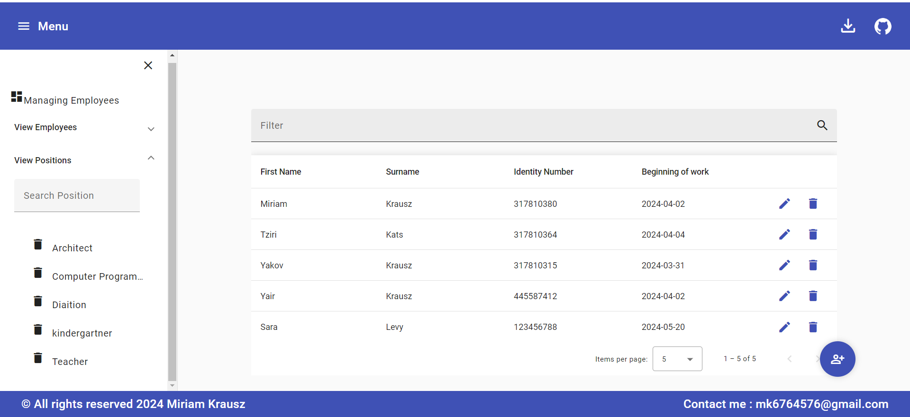

<a name="Employee List Management Application"></a>

<!-- PROJECT LOGO -->
<br />
<div align="center">
  <a href="https://github.com/MiriamKrausz/employees-project">
    
  </a>

  <h3 align="center">Employee List Management Application</h3>
</div>


<!-- TABLE OF CONTENTS -->
<details>
  <summary>Table of Contents</summary>
  <ol>
    <li>
      <a href="#about-the-project">About The Project</a>
      <ul>
        <li><a href="#built-with">Built With</a></li>
            <li><a href="#Features">Features</a></li>
      </ul>
    </li>
    <li>
      <a href="#getting-started">Getting Started</a>
      <ul>
        <li><a href="#installation">Installation</a></li>
      </ul>
    </li>
    <li><a href="#Additional Notes">Additional Notes</a></li>
    <li><a href="#contributing">Contributing</a></li>
    <li><a href="#license">License</a></li>
    <li><a href="#contact">Contact</a></li>
  </ol>
</details>


<!-- ABOUT THE PROJECT -->
## About The Project

[![Employees application][application-screenshot]](/employee_client/src/assets/images/screenshot.png)

This project is a web application built to manage employee lists for organizations. It allows users to view, add, edit, and delete employee information. The application consists of a front-end built with Angular 17 and Angular Material design libraries, and a back-end built with .NET 6.
The user interface of the application includes a table displaying employee details such as first name, last name, ID, and start date. Users can add, edit, and delete employees directly from the table. Additionally, the application provides options for adding additional information such as date of birth, gender, and roles dynamically.

## Features

- View employee list
- Add new employee
- Edit employee details
- Delete employee
- Search functionality
- Export employee list to Excel


### Built With

This section should list any major frameworks/libraries used to bootstrap your project. Leave any add-ons/plugins for the acknowledgements section. Here are a few examples.

- [![Angular][angular-icon]][angular-url]
- [![Angular Material][angular-material-icon]][angular-material-url]
- [.NET 6][dotnet-url]


<!-- GETTING STARTED -->
## Getting Started

### Front-end (Angular)

### Installation

_Below is an example of how you can instruct your audience on installing and setting up your app. This template doesn't rely on any external dependencies or services._

1. Get a free API Key at [https://github.com/MiriamKrausz/employees-project](https://github.com/MiriamKrausz/employees-project)
2. Clone the repository
   ```sh
   git clone https://github.com/MiriamKrausz/employees-project.git
   ```
3. Navigate to the `client` directory.

4. Install NPM packages to install dependencies
   ```sh
   npm install
   ```
5. Run `ng serve` to start the Angular development server.

6. Access the application at `http://localhost:4200`.

### Back-end (.NET)

1. Navigate to the `server` directory.

2. Open the solution in Visual Studio or any other preferred IDE.

3. Ensure you have SQL Server installed and running.

4. Run `update-database` command in the Package Manager Console to apply migrations and update the database schema.

  ```sh
   update-database
   ```
5. Run the application

6. The API endpoints will be accessible at the specified routes.


<!-- USAGE EXAMPLES -->
## Additional Notes

- Input integrity validations have been implemented to ensure data consistency and accuracy.
- Logical deletion is performed for deleted employees, and they will not appear in the main employee list.
- Emphasis has been placed on effective division of layers and writing clean, maintainable code.
- The design of the application has been made user-friendly and visually appealing.


<!-- CONTRIBUTING -->
## Contributing

Contributions to the project are welcome. If you encounter any issues or have suggestions for improvements, please open an issue or submit a pull request.**greatly appreciated**.


<!-- LICENSE -->
## License

© 2024 Miri Krausz All rights reserved. 


<!-- CONTACT -->
## Contact

Miriam Krausz- mk6764576@gmail.com

Project Link: [https://github.com/MiriamKrausz/employees-project](https://github.com/MiriamKrausz/employees-project)


